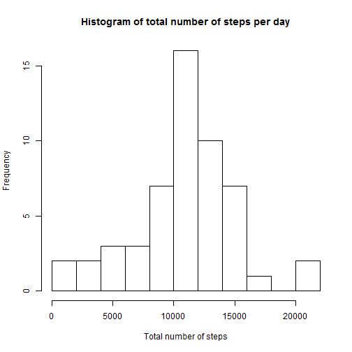
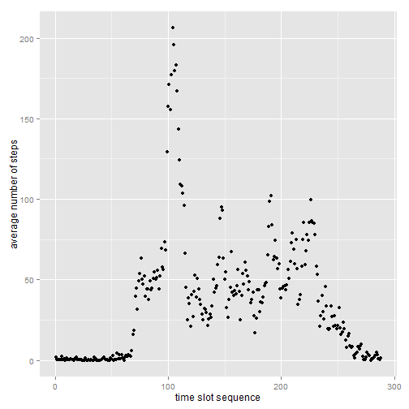
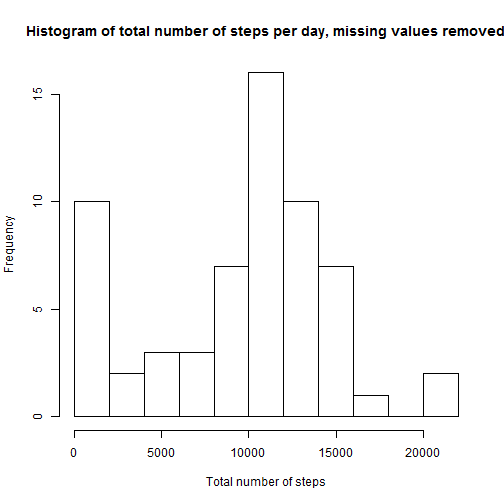

# Introduction
This assignment performs some analysis of data from a personal activity monitoring device. This device collects data at 5 minute intervals through out the day. The data consists of two months of data from an anonymous individual collected during the months of October and November, 2012 and include the number of steps taken in 5 minute intervals each day.

# Loading data
Data are available at [here](https://d396qusza40orc.cloudfront.net/repdata%2Fdata%2Factivity.zip)
and was downloaded at Thu Sep 17 11:18:53 2015. After reading the data the interval sequence number within a day is calculated through simple arithmetics.

```r
data<-read.csv("activity.csv")
```

```
## Warning in file(file, "rt"): cannot open file 'activity.csv': No such file
## or directory
```

```
## Error in file(file, "rt"): cannot open the connection
```

```r
data$intseq <- (data$interval-40 * floor(data$interval / 100) )/5+1
```

# Mean total number of steps per day


```r
hist(tapply(data$steps, data$date, sum), main = "Histogram of total number of steps per day", xlab = "Total number of steps", breaks=12)
```

 

```r
summary(tapply(data$steps, data$date, sum), na.rm = TRUE)
```

```
##    Min. 1st Qu.  Median    Mean 3rd Qu.    Max.    NA's 
##      41    8841   10760   10770   13290   21190       8
```
Statistical summary, including mean and median are shown in above table.

#Average daily activity pattern

```r
library(ggplot2)
adap <- data.frame(cbind(tapply(data$steps, data$interval, mean, na.rm= TRUE), data$intseq))
colnames(adap)<-c("avg_steps","seq_no")
qplot(seq_no, avg_steps, data = adap, xlab ="time slot sequence", ylab = "average number of steps")
```

 
    
  Time series plot of average steps by interval is shown above.


```r
maxseq<-adap$seq_no[which(adap$avg_steps == max (adap$avg_steps,na.rm=TRUE))] [1]
maxhour<-floor((maxseq-1)/12)
maxminute<-5*(maxseq-12*maxhour-1)
#For convenience of the reader as in the knitted Rmd file it is not visible how we get to the below values.
#This syntax was followed in Rmd: Sequence number of the time slot with the highest average value is `r maxseq`
#and similarly in the 2nd line .
```

Sequence number of the time slot with the highest average value is 104.  
This means the 8 hours and 35 minutes time slot.

#Missing values
There are 2304 missing values in the original dataset. 
(Again for traceability: Rmd code of the above line is "There are backtickr sum(is.na(data))backtick missing values in the original dataset." - where backtick shall be replaced with a real back tick.)  
These missing values are filled with the median of the same 5-minute time slot.


```r
medians<-tapply(data$steps, data$interval, median, na.rm= TRUE)
data$steps2<-data$steps
for (i in 1:17568){
     if(is.na(data$steps[i])){
          data[i,5]<-medians[((i-1)/61)%%1*61+1]}}
hist(tapply(data$steps2, data$date, sum), main = "Histogram of total number of steps per day, missing values removed", xlab = "Total number of steps", breaks=12)
```

 

```r
summary(tapply(data$steps2, data$date, sum), na.rm = TRUE)
```

```
##    Min. 1st Qu.  Median    Mean 3rd Qu.    Max. 
##       0    6778   10400    9354   12810   21190
```
The above created summary table shows the mean and median values of the dataset where missing values are replaced with the median of the time slot. Estimated total average number of steps decreased.


